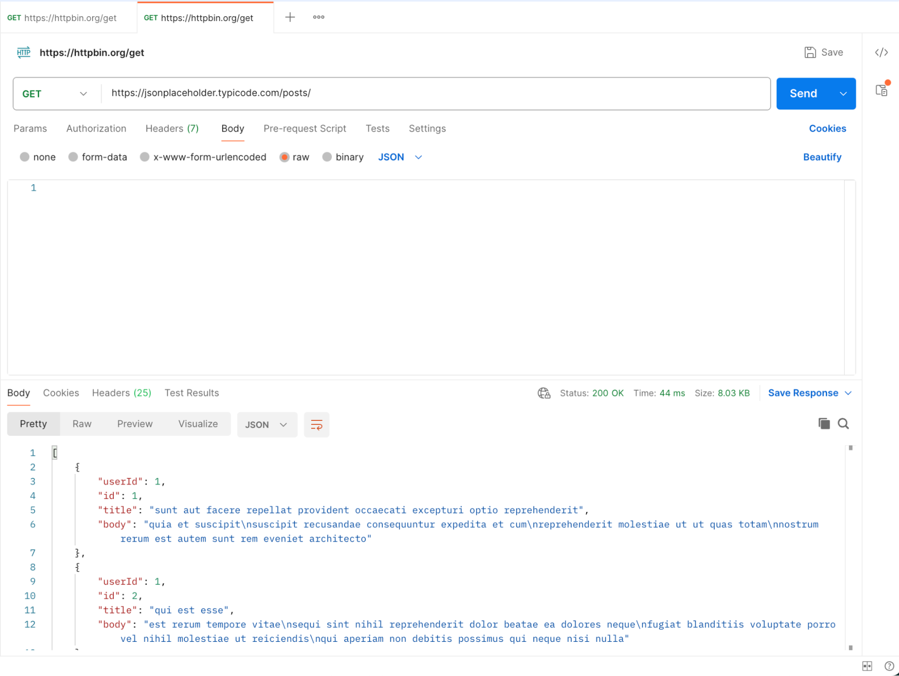

# Postman: An Introductory Guide for CS Freshmen

## Table of Contents
- [Introduction](#introduction)
- [What is an API?](#what-is-an-api)
- [What is a REST API?](#what-is-a-rest-api)
- [Why test APIs?](#why-test-apis)
- [How to install Postman](#how-to-install-postman)
- [Your First GET Request](#your-first-get-request)
- [POST Request with JSON](#post-request-with-json)
- [Troubleshooting](#troubleshooting)
- [Building Good Habits](#building-good-habits)
- [Summary](#summary)
- [References](#references)

## Introduction

In this tutorial, we will explore Postman. Postman is a valuable tool used to test APIs (Application Programming Interfaces), a major part of modern web development and software engineering. In fact, APIs power the internet, from tools like YouTube, Netflix, and even the website you're reading right now. There are many types of APIs, but Postman specializes in testing a specific subset of APIs known as REST (Representational State Transfer) APIs.

This guide will address the following:
1. What is an API? and more specifically what is a REST API?
2. Why do APIs need to be tested?
3. How to install the Postman client
4. How to use Postman to test APIs

### Disclaimers & Risks:
- In this tutorial, you install Postman, a proprietary closed-source software made by Postman, Inc. Postman software is prone to vulnerabilities that can arise from bugs in code written by Postman employees, which may compromise your computer to bad actors and malware. By installing Postman, you must acknowledge the terms and conditions of Postman, Inc. To check the vulnerability reporting policy of Postman, visit: <https://www.postman.com/trust/security/vulnerability-reporting/>

- In this tutorial, you will make API calls to exposed public API endpoints. Public API endpoints can expose user information such as IP addresses, and bad actors can intercept data. This tutorial provides templated inputs to prevent the exposure of sensitive user details and limit the exposure of user data, however safety is not guaranteed. At the moment of writing, these endpoints are public and not compromised; however, make sure to research the endpoint before sending a request to ensure safety.

- If you run into issues at any point in this tutorial, we recommend consulting the official Postman documentation: <https://learning.postman.com/docs/introduction/overview/>.

### Requirements:
- A computer with internet access and Windows, macOS, or Linux operating system.
- An updated browser like Chrome or Firefox for installation and checking documentation.
- Knowledge of JSON and URLs is useful but not required.

---

## What is an API?

As mentioned earlier, API stands for Application Programming Interface. Breaking this down, an **interface** is a way for two or more systems (or 'entities') to communicate (**program**), where at least one of them is an **application**. More formally **an API is a way that an end-user client** (whether another application or an individual such as yourself) can communicate with and **control an application**. For example, we can look at a simple library of books. We can think of a library as a service that allows us to 1) check out books, 2) return books, and 3) request new books to be added to the library.


*Fig. 1. The Library API: the Library system allows users to do three possible actions: check out books, return books, and request books without the user seeing the internals of each action.*

What we just described is an API! More formally, we can think of the Library as having an API that lets us 1) check out books, 2) return those books, and 3) request new books (denoted in the green bubbles and red text Fig 1). Notice we didn't talk about walking to the library and picking out the books nor did we talk about how a request for a new book gets processed. That's because we don't need to. 

In essence, an API **abstracts** this messy process of how something is done, away from us. If we want to check out twenty books, we could call the check out API twenty times, instead of explicitly saying, "walk to the library, pick out a book, go to the librarian, request the book be checked out, check out the book, and walk back" twenty times. 

We can extend this pattern and see that it's a very powerful idea, where you don't need to worry about how Netflix pulls up your favorite show, instead you could call the "Watch Show" API and not have to worry about it. While this is an oversimplification, it illustrates how powerful APIs can be.

---

## What is a REST API?

A REST API is a specific type of API that uses a set of rules and conventions for how applications should communicate with each other over the internet.

Think of it as adding a more standard set of instructions to our library analogy. While our library's API defines what you could do (check out, return, request), **a REST API** defines how you ask. It does this by using the same simple, standard methods that your web browser uses to get websites.

The most common methods are:
- **GET**: This is used to **read** or get information. This is like asking the librarian, "Can you **GET** me the book Moby Dick?" or "Can you **GET** me a list of all books by Charles Dickens?"
- **POST**: This is used to **create** something new. This is like filling out a "New Book Request" form and giving it to the librarian. You are **POST**ing a request to the library's system.
- **PUT / PATCH**: These are used to **update** existing information. This is like changing ownership of a book. You are **PUT**ting new books into your account.
- **DELETE**: This is used to **delete** something. This is like the librarian **DELETE**ing an old book that is damaged.

Below, you can see a sample diagram of how our API might look in the REST framework. We can update the state of the library through PUT methods to checkout and return books. We can POST a new book request to be handled, we can GET the information about a book, and we can DELETE an old book from the library (see Fig. 2).


*Fig. 2. A REST API uses standard HTTP methods such as GET, DELETE, PUT, and POST to manage library resources like books through requests.*

REST APIs also organize their interfaces by resource. A resource is a "thing" or "object" you want to get information about or take action on (Note: resources are typically plural nouns). In our analogy, these are books.

To specify which resource(s), REST provides the **path parameter** and **query parameter**, which is a way we can specify a **parameter** (an input) that tells us which resource we want to act on, such as a book identifier. Query parameters allow filtering over an input, while path parameters typically specify a singular input field. In our example we can denote the query parameter as `book_id` accepting a value of 'three_little_pigs'.

With the query parameter, a REST API could look like:
- `GET /books/?author_id=Charles-Dickens`: Gets information about all books in the library with author "Charles-Dickens".

With a path parameter being, an API could look like:
- `GET /books/three_little_pigs`: Gets information about a book in the library.

In short, a REST API, is an structured API that uses standard HTTP verbs (GET, POST, PUT, DELETE) to perform operations/actions on "resources" (like a user account, a video, or a library book) with "parameters" that let us control which resources we want to act on.

---

## Why test APIs?

So far, we've talked about why APIs are used, they provide convenient interfaces that serve as abstractions allowing end-users to communicate with an application. Earlier, it was mentioned that we don't need to worry about how these APIs work. That statement is partially correct, while we might not need to worry about how exactly these APIs are powered, we do need to make sure that they give us what we expect and do what they claim they do.

If checking out a book through the book check out API doesn't actually check a book out, then our library application has a big problem! So to make sure the APIs that we build (that already take care of the how) do what they say they do, we test APIs. One of the earliest and most influential ways to do this is through Postman, a proprietary closed-source tool that provides a generous free-tier to the public. 

While there are other open-source alternatives to test APIs (such as Bruno and Insomnia), due to the clean user interface, established market presence, and active support for Postman, this tutorial will use Postman to **test** APIs. The rest of this tutorial will focus specifically on using Postman to test APIs.

---

## How to install Postman

**Disclaimer**: Please visit <https://www.cvedetails.com/version-list/34480/168398/1/Postman-Postman.html?order=0> to read about the latest vulnerabilities in Postman software.

### Steps:

1. Download Postman (desktop app) and sign in (optional, but helps with syncing).
   - <https://www.postman.com/downloads/>
   - Pick the right download based on your computer's architecture (Fig. 3)

     
   *Fig. 3. Download screen for users to choose the right download depending on their operating system.*

2. Once you've installed it, you will be prompted to sign in. For this tutorial you DO NOT need to sign in. Instead click on "Switch to Lightweight API Client" (Fig. 4 & 5)

     
   *Fig. 4. Users may be prompted to sign in. This is not required.*

     
   *Fig. 5. When prompted to sign in, users are also given the option to switch to the lightweight API client.*

3. After this, you will see the main Postman user interface. (Fig. 6)

     
   *Fig. 6. The main Postman screen.*


### Know the layout:
1. **Left**: Collections (saved requests).
2. **Center**: Request builder (method, URL, params, headers, body).
3. **Bottom/Right**: Response (status code, time, size, body, headers).

Before testing real APIs, take a moment to explore the interface. Hover over buttons, open tabs, and try switching views. Postman gives you small hints when you hover, and understanding where everything is early on will make you much faster later when troubleshooting or testing larger projects.

---

## Your First GET Request

Let's start with something simple.

Click `"New" → "HTTP Request"`

Set the method to GET and the URL to `https://jsonplaceholder.typicode.com/posts/`.

Click `"Send"`

You'll see a response with status `200 OK`, meaning success. The body will contain data like a post title, user ID, and content (Fig. 7).

If you add `?userId=2` to the end of the URL, or use the Params tab to add a key of userId with a value of 2, Postman automatically appends it to the URL (Fig. 8).


*Fig. 7. A successful GET request in Postman returns data with a 200 OK status message, confirming that the API call worked.*


*Fig. 8. A GET request filtered with a query parameter (userId=2) to retrieve specific data.*

---

## POST Request with JSON

Now send data instead of just reading it.

Change the method to POST and set the URL to `https://jsonplaceholder.typicode.com/posts`.

In the Headers tab, add Content-Type as the key and application/json as the value.

In the Body tab, select "raw," then choose JSON from the dropdown, and paste:
```json
{
  "title": "Groovy",
  "body": "Groovier",
  "userId": 5
}
```

Click "Send." If everything is correct, you'll see status 201 Created and a JSON response showing your data with a new ID field (Fig. 9).

If you see a 400 Bad Request, double-check that your JSON is formatted correctly and that you set the Content-Type header properly.


*Fig. 9. A POST request in Postman successfully creates new data, returning a 201 Created message with the submitted JSON and new ID.*

---

## Troubleshooting

If something doesn't work:
- Check for typos in your URL or missing slashes.
- Make sure you're using the right method (GET vs POST).
- Validate your JSON structure.
- Confirm your authentication tokens are current.
- Use Postman's console (bottom left) to view detailed logs of requests and responses.

If it works in Postman but not in your web application, it might be a [CORS](https://developer.mozilla.org/en-US/docs/Web/HTTP/Guides/CORS) issue—Postman doesn't enforce browser restrictions, but browsers do.

For further resources we recommend consulting Stack Overflow, and the Postman Documentation.

---

## Building Good Habits

Always name your requests clearly (like `[GET] /libraries/books` or `[POST] /auth/users/`). Add a short description explaining what each one does. You can even write small "tests" in Postman to automatically check whether your API returned a 200 status or contains a certain JSON key.

---

## Summary

In this tutorial we covered, what is an API? And more specifically what is a REST API? We also talked about why testing APIs is useful and how to test APIs with Postman. Lastly, we covered edge cases and good habits to build as an API tester and builder.

Postman is one of the most powerful yet beginner-friendly tools you'll ever use as a developer. It simplifies API testing, debugging, and learning. Once you're comfortable with GET and POST requests, you can experiment with more advanced features like mock servers, automated testing, and documentation generation. To learn more about Postman's features and how to use them, consult the official Postman documentation.

Learning to use Postman effectively will help you not only in your CS classes but also in internships and real-world projects. You'll gain a better understanding of how front-end and back-end systems communicate, and more importantly, how to verify that everything actually works before your users ever see it.

---

## References

[1] Postman. (2025). *Postman: The collaboration platform for API development.* Postman. <https://www.postman.com/>

[2] Lane, K. (2019, October 10). *Intro to APIs: History of APIs.* Postman Blog. <https://blog.postman.com/intro-to-apis-history-of-apis/>

[3] GeeksforGeeks. (2020, December 20). *API testing – Software testing.* GeeksforGeeks. <https://www.geeksforgeeks.org/software-engineering/api-testing-software-testing/>

[4] Amazon Web Services. (2025). *What is an API? – API beginner’s guide.* Amazon Web Services, Inc. <https://aws.amazon.com/what-is/api/>

[5] Goodwin, M. (2024, April 9). *What is an API (application programming interface)?* IBM. <https://www.ibm.com/think/topics/api>

[6] Jasonjoh. (n.d.). *Use Postman with the Microsoft Graph API.* Microsoft Learn. <https://learn.microsoft.com/en-us/graph/use-postman>

[7] GeeksforGeeks. (2024, February 5). *Postman tutorial.* GeeksforGeeks. <https://www.geeksforgeeks.org/software-testing/postman-tutorial/>

[8] *Postman versions and number of CVEs, vulnerabilities.* (2025). CVE Details. <https://www.cvedetails.com/version-list/34480/168398/1/Postman-Postman.html?order=0>

[9] Mozilla Developer Network (MDN). (n.d.). *CORS (Cross-Origin Resource Sharing).* MDN Web Docs. <https://developer.mozilla.org/en-US/docs/Web/HTTP/Guides/CORS>


